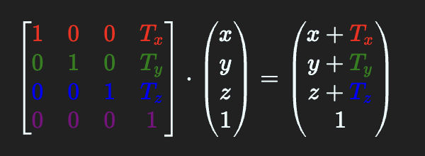
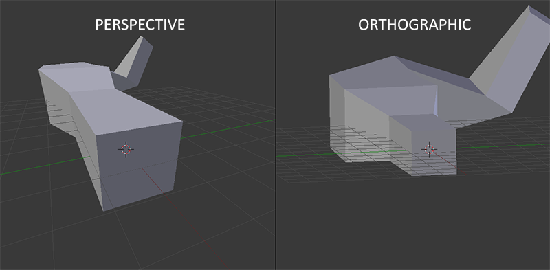
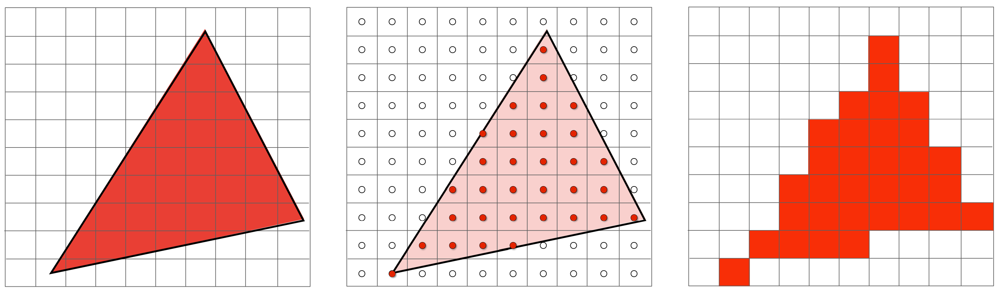
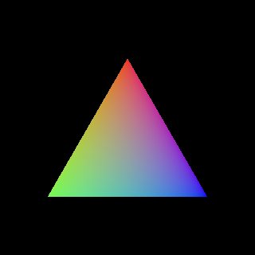
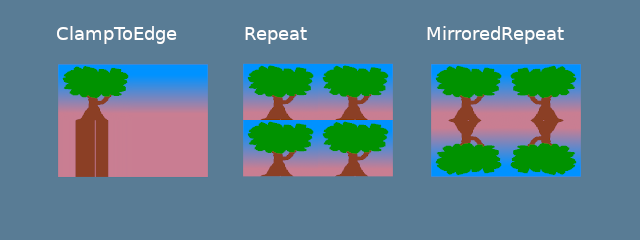

# 计算机图形学分享

*by：异梦 (2024-7-18)*

---

# 概述

简而言之，计算机就是研究怎么通过计算机去表示图形，去计算图形相关的问题的学科


计算机图形学的研究内容非常广泛，*如图形硬件*、*图形标准*、*图形交互技术*、*光栅图形生成算法*、*曲线曲面造型*、*实体造型*、*真实感图形计算与显示算法*、*非真实感绘制*，以及*计算可视化*、*计算机动画*、*自然景物仿真*、*虚拟现实*......


今天我分享的主要内容是：

* 简单了解图形学API，和OpenGL发展的历史

* 了解渲染管线，知道怎么画出一个三角形

---

# 图形学API

以及它们的历史

---

# OpenGL

它上世纪90年代起源于SGI公司
<!-- .element: class="fragment"-->

2006年，移交Khronos组织维护
<!-- .element: class="fragment"-->

它是一个跨平台的，用来渲染3D图形的API
<!-- .element: class="fragment"-->

当然，也支持向下兼容2D图形
<!-- .element: class="fragment"-->


严格来说，OpenGL只是一个标准

它的具体实现一般是由显卡厂商提供的
<!-- .element: class="fragment"-->

OpenGL的API虽然完全可以通过软件实现，但是它们在设计上是为硬件加速而设计的
<!-- .element: class="fragment"-->

因而，OpenGL的API往往是由显卡厂商的驱动程序提供的
<!-- .element: class="fragment"-->

也有一些*与OpenGL非常相似的API*的开源实现，如Mesa3D
<!-- .element: class="fragment"-->

> OpenGL是这样的，程序员只用调API就行了，可是驱动开发者需要考虑的事情就很多了
<!-- .element: class="fragment"-->


OpenGL的核心API只提供渲染的功能

它完全独立于窗口管理、输入处理等功能
<!-- .element: class="fragment"-->

但是这也导致了OpenGL的实现需要和其他API配合使用
<!-- .element: class="fragment"-->

即使不创建窗口，即时只创建一个OpenGL上下文，也是相当复杂的
<!-- .element: class="fragment"-->


创建和管理窗口的功能往往是通过窗口系统提供的API来实现的

不同(甚至相同)的平台操作都是不同的，非常的混乱
<!-- .element: class="fragment"-->

| 平台    | 窗口系统 | API        |
| ------- | -------- | ---------- |
| Windows | Win32    | GDI / UWP  |
| Linux   | X11      | Xlib / XCB |
| Linux   | Wayland  | Egl        |
| macOS   | Cocoa    | Quartz     |
| ...     | ...      | ...        |
<!-- .element: class="fragment"-->


好在，有一些跨平台的“多媒体库”，“窗口包”，如GLFW、SDL等，封装了窗口系统提供的底层API，帮助程序员简化这些极为繁琐操作，直接提供一个可用的OpenGL上下文


## 衍生版本

* OpenGL ES：OpenGL for Embedded Systems

用于移动设备、嵌入式设备等，比如Android、iOS
<!-- .element: class="fragment"-->

* WebGL：基于OpenGL ES的Web图形库

用于Web浏览器，让网页也可以调用GPU进行图形渲染
<!-- .element: class="fragment"-->

---

## 接下来介绍OpenGL的发展历程

虽然它已经跟不上时代了，但是还是很有必要了解一下

---

## 即时模式(1996-2010)

*Instant Mode*

很简单，但是效率**超低**，扩展性**极差**，已经被历史的车轮碾死了
<!-- .element: class="fragment"-->


用立即模式画一个三角形是什么样的？

OpenGL上下文，是一个全局状态机
<!-- .element: class="fragment fade-in"-->


如你所见，这个函数没有也不需要任何参数

``` c [1: 2 | 3-8 | 4 | 5-7 | 9]
void display() {
    glClear(GL_COLOR_BUFFER_BIT);   // 清屏
    glBegin(GL_TRIANGLES);          // 开始绘制三角形
        glColor3f(1.0, 0.0, 0.0);   // 设置颜色为红色
        glVertex2f(0.5, 0.1);       // 画三个顶点
        glVertex2f(0.1, 0.9);       // 传入的参数分别是x和y
        glVertex2f(0.9, 0.9);       
    glEnd();                        // 结束绘制
    glFlush();                      // 刷新
}      
```
<!-- .element: class="fragment fade-in"-->

像`GL_COLOR_BUFFER_BIT`，代表预先放在状态机里的一个颜色
<!-- .element: class="fragment"-->

像`glColor3f`这样的方法，可以改变OpenGL状态机，比如改变一个颜色
<!-- .element: class="fragment"-->


### 为什么说它效率低？

*每次*调用`glVertex2f`，CPU都会向GPU发送一次数据
<!-- .element: class="fragment"-->

### 为什么说它扩展性差？
<!-- .element: class="fragment"-->

它是固定管线，不需要~~也不支持~~自定义着色器，只能按照固定的流程来渲染图形
<!-- .element: class="fragment"-->

---

## 核心模式(2010-2017)

*Core Profile*

2002年，DirectX9引入的 *高级着色器语言(HLSL)* ，以及可编程管线，让OpenGL的立即模式显得非常落后
<!-- .element: class="fragment"-->

迫于DirectX的压力，OpenGL开始逐渐支持可编程管线，弃用固定管线
<!-- .element: class="fragment"-->

终于，在3.0版本中引入核心模式
<!-- .element: class="fragment"-->


核心模式提供的是一个完全不同的API

它放开了限制允许应用程序控制更多的细节
<!-- .element: class="fragment"-->

允许应用程序定义自己的着色器，去更精细地控制渲染管线
<!-- .element: class="fragment"-->

***渲染管线也是今天分享的重点，之后会着重介绍它***
<!-- .element: class="fragment"-->


核心模式相比于立即模式强大了很多很多，能够做很多以前根本做不到的事

但是，它也更加复杂，需要程序员自己管理很多细节
<!-- .element: class="fragment"-->

不过，这也是后来图形API发展的趋势：让程序员掌控更多
<!-- .element: class="fragment"-->

---

## 现在的OpenGL

*Deprecated*

实际上，随着API的不断迭代，它们的功能也越来越相似
<!-- .element: class="fragment"-->

OpenGL 4.3和DirectX 11的功能基本上也是一样的
<!-- .element: class="fragment"-->


### 不过......

2017年，Khronos组织宣布将不再维护OpenGL
<!-- .element: class="fragment"-->

2018年，WWDC上，苹果宣布将不再支持OpenGL，OpenGL ES等API
<!-- .element: class="fragment"-->


随着硬件的发展，OpenGL的设计已经不再适用于现代的GPU

OpenGL设计上的一些问题也逐渐暴露出来
<!-- .element: class="fragment"-->

全局状态机的设计，意味着OpenGL的API不是线程安全的，操作OpenGL状态机的代码只能是单线程的
<!-- .element: class="fragment"-->

虽然后来也有了提供多线程支持的扩展，但是这些扩展并不是标准的一部分，使用起来也很麻烦
<!-- .element: class="fragment"-->

OpenGL的遗留问题有一点太多了，导致了很多性能问题。驱动程序也需要额外做很多事，这也带来了很多兼容性问题，没必要的性能开销，甚至安全问题
<!-- .element: class="fragment"-->

---

# Vulkan

2016年发布（由Khronos组织维护）

Vulkan是一个新的图形API，它的设计目标是提供一个更加底层的API，让程序员可以更加细粒度的控制GPU
<!-- .element: class="fragment"-->

Vulkan的设计理念是：**不要隐藏硬件的细节，让程序员自己控制硬件**
<!-- .element: class="fragment"-->


### 性能更好

Vulkan的设计更加底层，程序员可以更加细粒度的控制GPU，这意味着程序员可以更好的利用GPU的性能
<!-- .element: class="fragment"-->

Vulkan针对多线程设计，每个线程都可以有自己的任务队列，向GPU发送数据和命令
<!-- .element: class="fragment"-->

Vulkan让驱动程序做的事情更少，这意味着更少的性能开销，更少的兼容性问题，更少的安全问题
<!-- .element: class="fragment"-->

*实际上是把任务交给了程序员*
<!-- .element: class="fragment"-->


### 跨平台
  
从PC到移动设备，从Windows到Linux，红绿蓝三家，都支持使用Vulkan
<!-- .element: class="fragment"-->

这也意味着桌面程序和移动程序可以共享很多代码，在以前，移动程序使用的是OpenGL的子集，但是现在可以使用一样的API了
<!-- .element: class="fragment"-->

*不过现实很骨感，因为安卓生态太~~混乱~~复杂了，OpenGL ES仍然占据安卓端的半壁江山，*
<!-- .element: class="fragment"-->


### 图形和计算统一

显卡最初是为了图形渲染而设计的，但是后来发现，显卡非常强大的并行计算能力不止可以用来渲染图形
<!-- .element: class="fragment"-->

于是有了*GPGPU*这个概念：通用图形处理器上的通用计算
<!-- .element: class="fragment"-->

在以前，*GPGPU*的API是*CUDA*和*OpenCL*，但是现在多了一个高性能且通用的选择：Vulkan
<!-- .element: class="fragment"-->

程序员也可以让计算管线和渲染管线协同工作，甚至用计算管线去模拟渲染管线
<!-- .element: class="fragment"-->


### 但是......

Vulkan的设计更加底层，程序员需要自己管理很多细节，这意味着Vulkan的学习曲线更陡峭
<!-- .element: class="fragment"-->

理想很美好，现实很骨感
<!-- .element: class="fragment"-->

很多游戏公司，尤其是小公司，可能并不会选择Vulkan，因为它的开发成本更高
<!-- .element: class="fragment"-->

也有的大游戏公司选择了Vulkan，然后带来了更低的性能，是的，*更低*
<!-- .element: class="fragment"-->

---

# 更多的API


## DirectX

微软的图形API，主要用于Windows平台

DX12(2015)也是一个更加底层API，和Vulkan类似


## Metal

苹果的图形API，主要用于macOS和iOS平台

Metal2(2017)也是一个更加底层API，和Vulkan类似

---

# WebGPU

WebGL的继任者，用于Web浏览器


<iframe 
    height="450"
    width="800"
    src="https://wgpu.rs/examples/?backend=webgpu&example=shadow"
></iframe>

这就是一个用WebGPU渲染的简单场景


类似于Vulkan，WebGPU也是一个更加底层的API

WebGPU也支持GPGPU
<!-- .element: class="fragment"-->

相比于其他API，WebGPU的实现不是驱动程序，而是浏览器的一部分
<!-- .element: class="fragment"-->

可以简单理解为WebGPU的“驱动程序”负责把WebGPU的API翻译成其他的底层的API
<!-- .element: class="fragment"-->

比如Vulkan，Metal，DirectX等
<!-- .element: class="fragment"-->


但是，WebGPU只能在浏览器使用吗？

答案是，不是！
<!-- .element: class="fragment"-->

如果单独把WebGPU的那一部分提取出来，作为一个独立的库
<!-- .element: class="fragment"-->

就得到了一个真正意义上全平台的图形库
<!-- .element: class="fragment"-->

比如wgpu-rs
<!-- .element: class="fragment"-->

不管是桌面程序，还是移动程序，还是Web程序，只用写一份代码就好了
<!-- .element: class="fragment"-->

---

# 渲染管线

*Render Pipeline*

故事到此为止，接下来，上强度了
<!-- .element: class="fragment"-->


前面提到的所有图形API都是3D的，但是，屏幕只是2D的而已

渲染管线做的事情，简单来说就是把3D的物体渲染到2D的屏幕上
<!-- .element: class="fragment"-->


这张图抽象地介绍了渲染管线的工作流程，接下来，将详细介绍它的每个阶段
<!-- .element: class="fragment"-->

---

## 描述物体

*Vertex Data*

怎么用数据去描述物体？
<!-- .element: class="fragment"-->


<div>
</div>


看起来很简单？用一组顶点数据就够了？

实际上，这个过程中有不少“显而易见”但是重要的细节，之后会讲
<!-- .element: class="fragment"-->

---

## 标准设备坐标系

*Normalized Device Coordinates*

你眼中的世界
<!-- .element: class="fragment"-->


描述一个坐标，首先需要有一个坐标系

在计算机图形学中，我们使用的是*标准设备坐标系*
<!-- .element: class="fragment"-->


窗口的大小不是固定的，不同的设备也不同的分辨率

OpenGL在设计时引入了这个概念，空间中的所有物体的坐标都是相对于这个坐标系的
<!-- .element: class="fragment"-->

不同API的标准设备坐标系可能略有区别，但是基本上都是一个正方体，边长为2，中心在原点


WebGPU的NDC是一个右手坐标系

画面的中心就是原点，x轴向"右"，y轴向"上"，z轴向"内"

`$$x \in [-1.0, 1.0]$$`

`$$y \in [-1.0, 1.0]$$`

`$$x \in [0.0, 1.0]$$`


或者，用几张张图总结

<table><tr>
    <td>
        坐标
        
    </td>
    <td>
        深度
        
    </td>
    <td>
        纹理
        
    </td>
</tr></table>


如果一个三角形的某些顶点不在NDC中

渲染管线会按照情况进行裁剪和丢弃
<!-- .element: class="fragment"-->

---

## 顶点数据

*Vertex Data*

顶点着色器能做很多事情，不过在此之前，先了解一下它的输入吧
<!-- .element: class="fragment"-->


这是一个顶点着色器的输入，在着色器代码中被抽象成一个结构体
``` wgsl [1: ]
struct VertexInput {
    @location(0) pos: vec3f; 
}
```

<div class="fragment">
这是它在rust代码中的表示

``` rust [1: ]
struct Vertex {
    pos: [f32; 3]
}
```
</div>


看起来一一对应？实际上，麻烦的多

我们需要让GPU知道怎么解析顶点缓冲区，以及顶点缓冲区是哪个缓冲区
<!-- .element: class="fragment"-->

具体是怎么做的呢？
<!-- .element: class="fragment"-->


首先准备好CPU上的顶点数据

``` rust [1: ]
let vertices = &[
    Vertex::new([ 0.5,  0.5, 0.5]),
    Vertex::new([-0.5, -0.5, 0.5]),
    Vertex::new([ 0.5, -0.5, 0.5]),
    Vertex::new([-0.5,  0.5, 0.5]),
    Vertex::new([-0.5, -0.5, 0.5]),
    Vertex::new([ 0.5,  0.5, 0.5]),
];
```


然后创建一个GPU上的缓冲区，并把顶点数据传输给GPU

``` rust [1: ]
let vertices = bytemuck::cast_slice(vertices);
let vertex_buffer = device.create_buffer_init(
    &wgpu::util::BufferInitDescriptor {
        label: None,
        contents: vertices,
        usage: wgpu::BufferUsages::VERTEX,
    }
);
```


以及，告诉GPU顶点缓冲区的布局，也就是告诉GPU怎么解析顶点数据

``` rust [1: ]
let vertex_buffer_layout = wgpu::VertexBufferLayout {
    array_stride: mem::size_of::<Vertex>() as _,
    step_mode: wgpu::VertexStepMode::Vertex,
    attributes: &[
        wgpu::VertexAttribute {
            offset: 0,
            shader_location: 0,
            format: wgpu::VertexFormat::Float32x3,
        },
    ],
};
```

然后操作渲染管线和*render pass*，GPU就知道怎么怎么解析，从哪里解析出顶点了

<div class="fragment">

然后调用*render pass*的*draw*方法，图形就会被绘制

``` rust
render_pass.draw(0..vertices.len() as _, 0..1);
```

</div>

*draw*方法的两个参数分别是要绘制的*顶点*和*实例*的范围，后者暂时忽略
<!-- .element: class="fragment"-->

0..vertices.len() as _表示绘制所有顶点
<!-- .element: class="fragment"-->


*VertexBufferLayout*的*array_stride*字段描述了从一个顶点到另一个顶点之间的字节数目

``` rust [1: 1-11 | 2]
let vertex_buffer_layout = wgpu::VertexBufferLayout {
    array_stride: mem::size_of::<Vertex>() as _,
    step_mode: wgpu::VertexStepMode::Vertex,
    attributes: &[
        wgpu::VertexAttribute {
            offset: 0,
            shader_location: 0,
            format: wgpu::VertexFormat::Float32x3,
        },
    ],
};
```

我们设置*array_stride*为顶点的大小，也就是三个浮点数的大小，12字节


然后，GPU就会从第0字节，第12字节...第 *(vertices.len()-1)\*array_stride*字节为起始点解析每一个顶点
<div class="fragment">

具体的做法，用rust代码表示，大概是这样的：

``` rust
let vbo = &[...]
let vi_paris = vertices_range 
        .map(|v| instances_range.map(|i| (v, i)))
        .flatten();
for (vertex_idx, instance_idx) in vi_paris {
    let vertex_offset = vertex_idx * array_stride;
    let vertex = parse_vertex(&vbo[vertex_offset..]);
    ...
}
```

</div>

GPU在做这件事时，可以高度并行化，提高效率，渲染管线的其他部分也都是这样的设计
<!-- .element: class="fragment"-->


*step_mode*指示GPU何时从一个顶点步进到下一个顶点

``` rust [1: 1-5 | 3]
let vertex_buffer_layout = wgpu::VertexBufferLayout {
    array_stride: mem::size_of::<Vertex>() as _,
    step_mode: wgpu::VertexStepMode::Vertex,
    attributes: &[ ... ],
};
```

我们暂且设置为*VertexStepMode::Vertex*
<!-- .element: class="fragment"-->

``` rust [1: 1-5 | 2]
for (vertex_idx, instance_idx) in vi_paris {
    let vertex_offset = vertex_idx * array_stride;
    let vertex = parse_vertex(&vbo[vertex_offset..]);
    ...
}
```
<!-- .element: class="fragment"-->

对应这里使用*vertex_idx*
<!-- .element: class="fragment"-->


*attributes*描述怎么从一个数据中解析出顶点

``` rust [1: 1-11 | 4-10]
let vertex_buffer_layout = wgpu::VertexBufferLayout {
    array_stride: mem::size_of::<Vertex>() as _,
    step_mode: wgpu::VertexStepMode::Vertex,
    attributes: &[
        wgpu::VertexAttribute {
            offset: 0,
            shader_location: 0,
            format: wgpu::VertexFormat::Float32x3,
        },
    ],
};
```

这里，我们只设置了一个*顶点属性*，也就是*pos*
<!-- .element: class="fragment"-->


``` rust [1: ]
wgpu::VertexAttribute {
    offset: 0,
    shader_location: 0,
    format: wgpu::VertexFormat::Float32x3,
},
```

*offset*描述这个属性在顶点数据中的偏移量
<!-- .element: class="fragment"-->

*shader_location*描述这个属性在顶点中的“位置”
<!-- .element: class="fragment"-->

<div class="fragment">

``` wgsl [1: ]
struct VertexInput {
    @location(0) pos: vec3f; 
}
```

对应着色器代码中的 *@location(0)*

</div>

*format*很好理解，描述应该用什么格式解析这个属性
<!-- .element: class="fragment"-->

在这里是一个三维向量，也就是三个32位浮点数，所以是*Float32x3*
<!-- .element: class="fragment"-->


就这样，GPU并行地从顶点缓冲区中解析出顶点，然后调用顶点着色器处理这些顶点...

---

## 顶点着色器

*Vertex Shader*

第一段GPU程序
<!-- .element: class="fragment"-->


顶点着色器是渲染管线的第一个阶段

从OpenGL 3.0开始，顶点着色器不再是固定的
<!-- .element: class="fragment"-->


顾名思义，顶点着色器就是用来处理顶点的

<div class="fragment">
在代码中，它表现为一个函数

``` wgsl
@vertex
fn vs_main(@location(0) pos: vec3f) -> @builtin(position)
```

</div>

它对输入的每组顶点进行处理，输出新的数据
<!-- .element: class="fragment"-->


来看一个最简单的顶点着色器

``` wgsl [1-4 | 6-9 | 11-16]
// 输入
struct VertexInput {
    @location(0) pos: vec3f; 
}

// 输出
struct VertexOutput {
    @builtin(position) pos: vec4f,
}

// 什么都不做，只是把向量变成四维的而已
@vertex
fn vs_main(in: VertexInput) -> VertexOutput {
    return VertexOutput { pos: vec4(in.pos, 1.0) };
}
```

*顶点着色器输出的是一个四维向量：xyzw*
<!-- .element: class="fragment"-->


<div>
<video
    data-autoplay
    src="./video/顶点着色器.mp4"
></video>
</div>


顶点着色器往往就是用来对顶点的坐标进行变换的，上一个视频也体现了它的这个作用

这里不得不说一下最经典也最常见的一套变换：*模型* - *视图* - *投影* 变换
<!-- .element: class="fragment"-->


### 局部空间-模型变换

*模型变换*让一个物体从它在它的*局部空间*进行一系列变换，以及变换到*世界空间*
<!-- .element: class="fragment"-->

常见的变换有：旋转，缩放，平移，前两者是对*局部空间*的变换，最后一个是将局部*空间变换*到*世界空间*
<!-- .element: class="fragment"-->

旋转很简单，使用三角函数就可以很容易地创建一个旋转矩阵
<!-- .element: class="fragment"-->

缩放也很简单，只需要修改一个其次矩阵的主对角线就可以创建一个缩放矩阵
<!-- .element: hclass="fragment"-->


...那么平移呢？

对于一个三维的变换，比如旋转，缩放，用一个三维的矩阵就可以了。但是平移变换无法用一个三维的矩阵表示
<!-- .element: class="fragment"-->

使用四维向量，四维矩阵的主要目的之一，就是为了实现三维空间的平移变换
<!-- .element: class="fragment"-->




矩阵的最后一列的前三行，可以用来描述平移

模型变换之后，物体的坐标是相对于物体的局部坐标系的，再经过一次平移变换，就可以把物体放到世界坐标系中了
<!-- .element: class="fragment"-->


问题来了：平移就是让一个向量加上另一个向量，为什么要用矩阵乘法？

旋转，缩放，平移是三个变换，对于同一个物体的每个顶点，都需要依次进行这三个变换，需要做三次矩阵乘法
<!-- .element: class="fragment"-->

但是矩阵是可以叠加的，两个矩阵进行矩阵乘法，得到的矩阵的效果，就是两个矩阵的效果的叠加
<!-- .element: class="fragment"-->

所以，我们可以把三个变换合并成一个矩阵，这时候，只需要做一次矩阵乘法，就可以实现想要的效果
<!-- .element: class="fragment"-->


### 观察空间-视图变换

作为观察者（摄像机），观察者所看到的世界又是一个相对于观察者的坐标系
<!-- .element: class="fragment"-->

这个空间叫做*观察空间*，在这个空间，观察者的坐标是原点，观察者的方向是z轴
<!-- .element: class="fragment"-->

通过旋转和平移变换，很容易把*世界空间*的物体变换到*观察空间*中
<!-- .element: class="fragment"-->


### 裁剪空间-投影变换

投影变换将*观察空间*中的物体投射到*裁剪空间*中，并且实现透视效果
<!-- .element: class="fragment"-->

投影有两种：*透视投影*和*正射投影*
<!-- .element: class="fragment"-->


<!-- .element: class="fragment"-->


通过强大的线性代数，用一个投影矩阵可以实现投影效果，以及把一定范围（*平截头体*）内的坐标映射到一个固定的范围
<!-- .element: class="fragment"-->


w分量的另一个妙用，就是和透视投影相配合，实现透视效果   
<!-- .element: class="fragment"-->

投影矩阵会修改w分量，物体离观察者越远，w分量就越大
<!-- .element: class="fragment"-->

最后，GPU将输出的四维向量除以它的w分量，得到NDC坐标
<!-- .element: class="fragment"-->

w分量大的物体会更大，看起来就像被投影到远处，反之亦然。
<!-- .element: class="fragment"-->

如此，便实现了透视效果
<!-- .element: class="fragment"-->


而没有被映射到裁剪空间内的物体，也不会被映射到NDC中，会被自动裁剪掉，就不会显示

所以说，平截头体的大小，就是所谓“视野”的大小
<!-- .element: class="fragment"-->

有的游戏没有处理好碰撞箱，导致摄像机和墙贴得太近了，面前的墙出现在*平截头体*之外，就出现了视野穿墙的bug
<!-- .element: class="fragment"-->

---

## 几何着色器

*Geometry Shader*

没用过
<!-- .element: class="fragment"-->


几何着色器是(我找的那张图中)渲染管线的第二个阶段

它能够接收顶点着色器的输出，然后产生更多的顶点数据
<!-- .element: class="fragment"-->

几何着色器是可选的，不是所有的GPU都支持
<!-- .element: class="fragment"-->

再加上它性能差劲，不如实例化和计算管线等原因，WebGPU没有几何着色器
<!-- .element: class="fragment"-->

下一个
<!-- .element: class="fragment"-->

---

## 图元装配

*Primitive Assembly*

初具图形
<!-- .element: class="fragment"-->


这一阶段的工作是从*顶点*中组装出*图元*

更具体的说，就是把*顶点*组装成三角形，线段，点等*图元*
<!-- .element: class="fragment"-->

这个阶段的工作是完全是由GPU硬件自动完成的，程序员可以在创建渲染管线时指定一些参数，控制图元装配的行为
<!-- .element: class="fragment"-->

``` rust
let primitive = wgpu::PrimitiveState {
    topology: wgpu::PrimitiveTopology::TriangleList,
    strip_index_format: None,
    front_face: wgpu::FrontFace::Ccw,
    cull_mode: Some(wgpu::Face::Back),
    polygon_mode: wgpu::PolygonMode::Fill,
    unclipped_depth: false,
    conservative: false,
},
``` 
<!-- .element: class="fragment"-->


```rust
let topology = wgpu::PrimitiveTopology::TriangleList;
let strip_index_format = None;
```

*topology*描述了图元的类型，比如三角形，线段，点等，这也决定图元装配的行为

*wgpu::PrimitiveTopology::TriangleList*表示输入的*顶点*是“三角形列表”，也就是每三个顶点组成一个三角形，这也是在之前的视频里的行为
<!-- .element: class="fragment"-->

*strip_index_format*描述了图元装配时的索引格式，这个参数只有在*topology*设置为一些特定值时有用，这里不用设置
<!-- .element: class="fragment"-->


``` rust
let front_face = wgpu::FrontFace::Ccw;
```

*front_face*指定什么顺序是“正面”

想象一下，一个三角形，如果从正面观察它发现它是三个顶点是顺时针排列的
<!-- .element: class="fragment"-->

那么从背面按照一样的顺序观察那三个顶点，这时候这三个顶点就是逆时针排列的
<!-- .element: class="fragment"-->

这里通过设置这个参数来指定顶点以什么顺序排列是正面，这里指定为逆时针(Ccw)是正面，也就是说指定一个三角形的三个顶点逆时针排列，这个三角形就朝向正面
<!-- .element: class="fragment"-->


``` rust
let cull_mode = Some(wgpu::Face::Back);
```

*cull_mode*就是与之相关的优化
<!-- .element: class="fragment"-->

这里设置为 *Some(wgpu::Face::Back)* ，表示让GPU丢弃朝向背面的三角形，这样就不会渲染背面，大幅提高性能
<!-- .element: class="fragment"-->


``` rust
let polygon_mode = wgpu::PolygonMode::Fill;
```

*polygon_mode*指定多边形模式，或者说怎么从图元生成*片元(Fragment)*

*wgpu::PolygonMode::Fill*表示填充，对于三角形，GPU会把三角形的内部填充，生成一个实心的三角形
<!-- .element: class="fragment"-->

如果是*wgpu::PolygonMode::Line*，对于三角形，GPU会生成一个三角形的边框，也就是三条线段
<!-- .element: class="fragment"-->

*后两个选项忽略*
<!-- .element: class="fragment"-->

---

## 光栅化

*Rasterization*

按照德语直译就是“在屏幕上绘制”，不要被名字吓到
<!-- .element: class="fragment"-->


前面的过程中，所有数据都是在NDC中的

在光栅化这一过程，GPU会把*图元*转换成*片元*，每一个*片元*对应屏幕上的一个像素点
<!-- .element: class="fragment"-->


<!-- .element: class="fragment"-->


我们这里不过多考虑其中细节，只需要知道每个*片元数据*都是经过*线性插值*得到的即可
<!-- .element: class="fragment"-->

具体什么意思呢？顶点着色器的输出只是一个顶点的数据
<!-- .element: class="fragment"-->

而一个*图元*，比如说三个顶点围成的三角形，它大多时候都会有超过大量(不止三个)像素点
<!-- .element: class="fragment"-->

甚至呢，一个顶点所对应的像素点的位置，可能会在两个像素点之间——现实中可没法把像素点拆开用
<!-- .element: class="fragment"-->

这时候，GPU就会对根据像素点的位置和顶点的位置，对顶点着色器的输出进行*线性插值*，得到该像素点所对应的片元的数据
<!-- .element: class="fragment"-->


<div class="fragment">



这也解释了为什么会只需要设置一个等边三角形的三个顶点的颜色为R，G，B，显卡就会自动画出一个渐变三角形

可以看到，中点的颜色是灰色，亮度是纯白的三分之一的灰色，这就是线性插值的结果

</div>

---

## 片元着色器

*Fragment Shader*

世界有了颜色，光与影在此交织
<!-- .element: class="fragment"-->


大多数时候，片元着色器是用来计算光照，阴影，纹理等效果的

这一步，GPU会对每一个*片元数据*进行处理，得到的结果就是这个片元的颜色，也就是像素点的颜色，字面意义上的着色器
<!-- .element: class="fragment"-->

这一步一般都是图形管线中最消耗性能的一步，所有有很多围绕它的优化，之后会讲其中的一种
<!-- .element: class="fragment"-->


刚才的三角形的片元着色器是这样的

```wgsl [1: 1-8 | 1-4 | 6-9]
struct VertexOutput {
    @builtin(position) pos: vec4f,
    @location(1) color: vec3f
}

@fragment
fn fs_main(in: VertexOutput) -> @location(0) vec4f {
    return vec4(in.color, 1.0);
}
```

片元着色器的输入就是（经过线性插值的）顶点着色器的输出
<!-- .element: class="fragment"-->

这里的输出是一个四维向量，对应颜色的RGBA通道，这里只是简单地将线性插值后的结果输出
<!-- .element: class="fragment"-->


光照，阴影，纹理，前两者因为涉及到了光线的计算，所以会比较复杂，这里不展开讲不过*纹理*值得一说

相比于想方设法把画一比一画下来，还是直接复印一份来得快
<!-- .element: class="fragment"-->

纹理就是如此，能够让显卡直接绘制现有的图片
<!-- .element: class="fragment"-->


图片只是二维的，所以很容易想到用两个数字来描述图片上的一个点，这就是*纹理坐标*

通过纹理坐标，定位到图片上的某个点，得到这个点的颜色的过程，叫做*纹理采样*

纹理坐标是一个二维向量，每个分量的范围是[0, 1]，这使得纹理坐标非常自由，不会被图片的大小所限制

不过，就像光栅化这一步中顶点坐标和像素点不一定对应，这里也会有这样的问题：如果*纹理坐标*不能准确地对应到一个像素点，怎么办？
<!-- .element: class="fragment"-->

这时候，就需要*纹理过滤*来解决这个问题，常见的做法有两种：*线性过滤*和*最近邻过滤*
<!-- .element: class="fragment"-->


### 线性过滤

*Linear Filtering*


很简单，就是对*纹理坐标*附近的四个像素点的颜色进行线性插值，得到这个*纹理坐标*对应的颜色

这样得到的结果会比较平滑，不会有明显的锯齿状，但是会有一些模糊


### 最近邻过滤

*Nearest Neighbor Filtering*


做法是直接找到离*纹理坐标*最近的像素点的颜色，这样得到的结果会有明显的锯齿状，但是不会有模糊

常见于像素风格的游戏，毕竟不平滑的像素点就是这些游戏的画面特征


纹理坐标的范围一般都是[0, 1]，但是也可以是其他的范围

GPU不能像CPU一样在出现越界的纹理时发出尖锐的爆鸣声，或者是直接崩溃
<!-- .element: class="fragment"-->

所以，程序员需要定义纹理坐标的越界行为，这个行为叫做*纹理寻址*
<!-- .element: class="fragment"-->

通过设置纹理寻址也可以实现一些有趣的效果
<!-- .element: class="fragment"-->


这是常见的三种纹理寻址方式，*Clamp*，*Repeat*，*Mirror*，看图很容易理解



---

## 深度缓冲区

*Depth Buffer*

Z轴有什么用？
<!-- .element: class="fragment"-->


屏幕是二维的，但是NDC空间是三维的，这中间必然发生了一些转换

实际上，很简单，就是xy坐标和直接对应屏幕上的像素点(光栅化)，至于Z轴...直接忽略
<!-- .element: class="fragment"-->

在想象中，Z轴更小的物体应该被绘制在Z轴更大的物体的前面，但是图形管线是不会管这个的
<!-- .element: class="fragment"-->

谁后被绘制，谁就在前面，这是默认的做法
<!-- .element: class="fragment"-->


不过，如果我们想要实现这个效果，可以使用*深度缓冲区*

它是一个纹理，大小是屏幕的尺寸，每个"像素点"存储着这个像素点对应的片元的坐标的Z值
<!-- .element: class="fragment"-->

它会比较片元的Z值和深度缓冲区中的Z值，如果片元的Z值更小，就会被绘制，否则就会被丢弃
<!-- .element: class="fragment"-->

这样，就可以实现物体的遮挡效果了
<!-- .element: class="fragment"-->

实际上，这一步往往在片元着色器之前，这样可以减少大量不必要的片元着色器的计算
<!-- .element: class="fragment"-->
